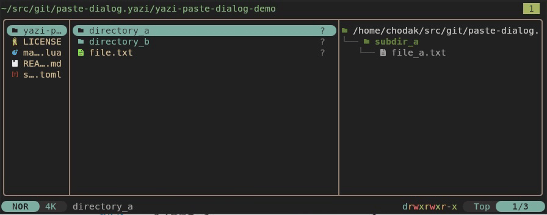

# paste-dialog.yazi

A [yazi](https://github.com/sxyazi/yazi) plugin that shows an interactive
conflict-resolution dialog when pasting files. Instead of silently appending
`_1`, `_2` suffixes to conflicting names, you choose how to handle each
conflict individually.



| Option | Action | Description |
|--------|--------|-------------|
| **Merge** | merge / overwrite | Merge directory contents recursively; overwrite individual files. _(default — press Enter)_ |
| **Merge all remaining** | merge / overwrite | Same as Merge, but applied to every remaining conflict without prompting again. |
| **Replace** | replace | Delete the destination entirely, then copy fresh (removes files that exist only at the destination). |
| **Rename** | rename | Prompt for a new name, pre-filled with `name-yymmdd`. If the new name also conflicts the dialog reappears with a different default (`name-2`, `name-3`, …). |
| **Skip** | skip | Leave this item untouched. |
| **Cancel** | abort | Paste any non-conflicting items already queued, then stop. _(Esc)_ |

Non-conflicting items always paste silently — the dialog only appears when a
conflict is detected.

> ⚠️ **This plugin requires a modified version of yazi.**
> See [Requirements](#requirements) below.

---

## Requirements

This plugin depends on Rust-level changes to yazi that have **not** been merged
into upstream:

| Change | Why it's needed |
|--------|----------------|
| `paste_resolved` actor + parser | Per-item paste with explicit `from`/`to`/`overwrite`/`replace` — not possible with the existing `ya.emit("paste")`. |
| `file_copy_one` / `file_cut_one` | Scheduler methods that accept individual source/destination URLs with a `replace` flag. |
| `ya.pick({ title=, items= })` | Exposes the existing pick dialog to Lua plugins (was internal-only). |
| `PickCfg::with_title()` | Lets `ya.pick()` override the dialog title. |

Build yazi from the fork:

```sh
git clone https://github.com/chodak166/yazi.git
cd yazi
cargo build --release

# Install the modified binaries on your PATH
cp target/release/yazi target/release/ya ~/.local/bin/
```

---

## Installation

### Option A — install via `ya pkg` (recommended)

```sh
ya pkg add chodak166/paste-dialog
```

### Option B — manual install

```sh
# 1. Create the plugin directory
mkdir -p ~/.config/yazi/plugins/paste-dialog.yazi

# 2. Download main.lua into it
curl -fsSL https://raw.githubusercontent.com/chodak166/paste-dialog.yazi/main/main.lua \
  -o ~/.config/yazi/plugins/paste-dialog.yazi/main.lua
```

### Add the keybinding

Add the following to `~/.config/yazi/keymap.toml` (the `prepend_keymap` keeps
all default bindings intact):

```toml
[[mgr.prepend_keymap]]
on   = "p"
run  = "plugin paste-dialog"
desc = "Paste with conflict dialog"
```

Restart yazi, then press <kbd>p</kbd> to paste with conflict resolution.

---

## Usage

1. Yank files (<kbd>y</kbd>) or cut them (<kbd>x</kbd>) as usual.
2. Navigate to the destination directory.
3. Press <kbd>p</kbd> to paste.
4. If there are conflicts a pick dialog appears for each one:
   - Navigate with <kbd>j</kbd>/<kbd>k</kbd> or arrow keys, confirm with <kbd>Enter</kbd>.
   - **Merge** — overwrites the destination file or merges directory contents.
   - **Merge all remaining** — merge this and all remaining conflicts without prompting.
   - **Replace** — deletes the destination entirely before copying (removes excess files).
   - **Rename** — shows an input prompt with `name-yymmdd` pre-filled. If the new name also conflicts, the dialog reappears; choosing Rename again cycles the default to `name-2`, `name-3`, etc.
   - **Skip** — leaves the destination untouched.
   - **Cancel** (or <kbd>Esc</kbd>) — pastes any queued clean items, then aborts.

---

## Notes

- **Merge** uses the scheduler's existing `force=true` behavior: new files are
  added, existing files are overwritten, destination-only files are preserved.
- **Replace** deletes the destination directory entirely before copying,
  removing any files that exist only in the destination.
- Deep conflicts within merged directories are resolved silently by
  overwriting individual files.
- **Cut + Skip** leaves the source file in place (it is not deleted).
- Between the conflict pre-scan and the actual paste, `overwrite=false` items
  fall back to `unique_file()` if a new conflict appears.

## License

MIT
